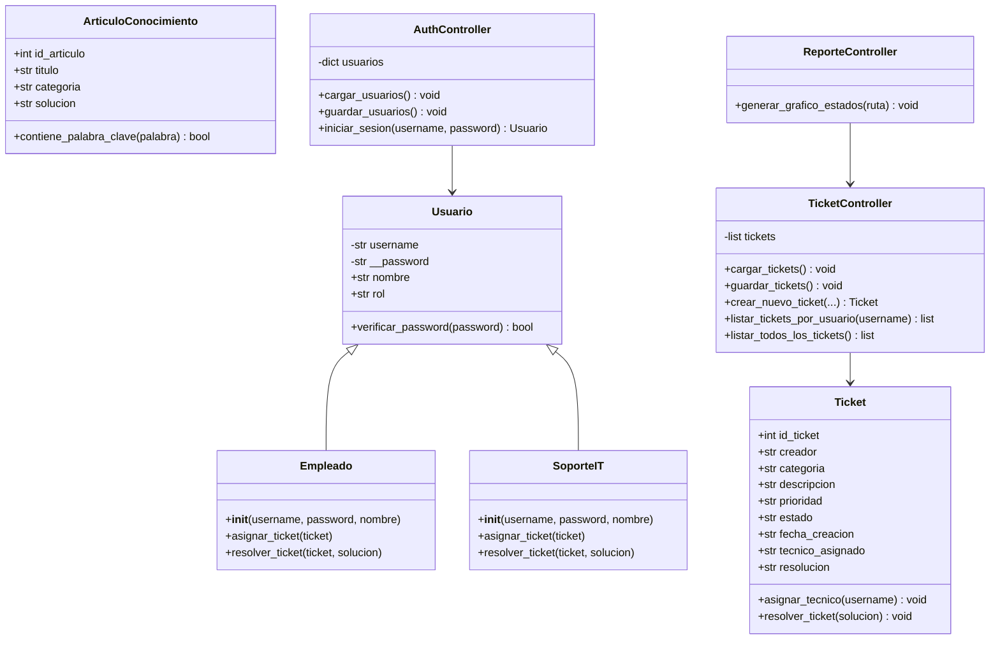

# 🎧 Help Desk — Sistema de Mesa de Ayuda

Sistema de gestión de tickets de soporte técnico desarrollado en Python, aplicando Programación Orientada a Objetos y arquitectura MVC con interfaz gráfica en tkinter.

---

## 📋 Descripción

Help Desk es una aplicación de escritorio que permite a los empleados de una organización reportar incidencias técnicas mediante tickets, y al equipo de Soporte IT gestionarlos, asignarlos y resolverlos. El sistema cuenta con dos roles diferenciados y una consola de estadísticas visual.

---

## 🎯 Objetivo

Desarrollar una aplicación funcional de mesa de ayuda que demuestre el uso correcto de POO, arquitectura MVC, persistencia de datos en JSON e interfaz gráfica con tkinter, como proyecto final del curso de Programación Orientada a Objetos.

---

## ✨ Características principales

- Autenticación de usuarios con dos roles: **Empleado** y **Soporte IT**
- Creación de tickets con categoría, prioridad y descripción
- Vista de tickets propios para el empleado
- Consola global de tickets para el técnico de soporte
- Asignación y resolución de tickets con registro de solución
- Doble clic en ticket para ver todos sus detalles
- Gráfico de estadísticas de tickets por estado con matplotlib
- Persistencia de datos en archivos JSON
- Interfaz gráfica moderna con tkinter

---

## 🛠️ Tecnologías utilizadas

- Python 3.x
- tkinter (interfaz gráfica)
- matplotlib (gráficos estadísticos)
- pytest (pruebas automatizadas)
- JSON (persistencia de datos)
- GitHub (control de versiones)

---

## 🏗️ Arquitectura del proyecto

El proyecto aplica el patrón **MVC (Modelo - Vista - Controlador)**:

- **Modelo** (`app/models/`): contiene las clases `Ticket`, `Usuario`, `Empleado`, `SoporteIT` y `ArticuloConocimiento`. Representan las entidades del sistema y su lógica de negocio.
- **Vista** (`app/views/`): contiene las ventanas gráficas construidas con tkinter. No contiene lógica de negocio.
- **Controlador** (`app/controllers/`): gestiona la persistencia y lógica principal (autenticación, tickets, reportes).
- **Controlador de interfaz** (`app/ui_controllers/`): conecta las vistas tkinter con los controladores de datos.

### Estructura de carpetas

```
proyecto-helpdesk-poo/
│
├── app/
│   ├── models/
│   │   ├── ticket.py
│   │   ├── usuario.py
│   │   └── base_conocimiento.py
│   │
│   ├── views/
│   │   ├── login_view.py
│   │   ├── ticket_view.py
│   │   ├── soporte_view.py
│   │   └── reporte_view.py
│   │
│   ├── controllers/
│   │   ├── auth_controller.py
│   │   ├── ticket_controller.py
│   │   └── reporte_controller.py
│   │
│   └── ui_controllers/
│       ├── login_ui_controller.py
│       ├── ticket_ui_controller.py
│       └── soporte_ui_controller.py
│
├── data/
│   ├── usuarios.json
│   └── tickets.json
│
├── tests/
│   └── test_helpdesk.py
│
├── docs/
│   └── capturas/
│
├── main.py
├── requirements.txt
├── LICENSE
└── README.md
```

---

## 📐 Diagrama de clases



---

## 🚀 Instalación

```bash
git clone https://github.com/jeslamprieto/proyecto-helpdesk-poo.git
cd proyecto-helpdesk-poo
pip install -r requirements.txt
```

---

## ▶️ Ejecución

```bash
python main.py
```

### Credenciales de prueba

| Rol | Usuario | Contraseña |
|---|---|---|
| Empleado | `weylis12` | `secure123` |
| Soporte IT | `tecnico_juan` | `admin123` |

---

## 🧪 Pruebas

```bash
pytest tests/ -v
```

El archivo `tests/test_helpdesk.py` incluye:
- 2 pruebas válidas de creación y gestión de tickets
- 2 pruebas válidas de autenticación de usuarios
- 2 pruebas inválidas con `pytest.raises` para validar errores esperados

---

## 👥 Integrantes

- Weilys Solano
- Santiago Ibañez
- Jeslam Prieto

---

## 📄 Licencia

Este proyecto está bajo la licencia MIT. Ver archivo [LICENSE](LICENSE) para más detalles.
